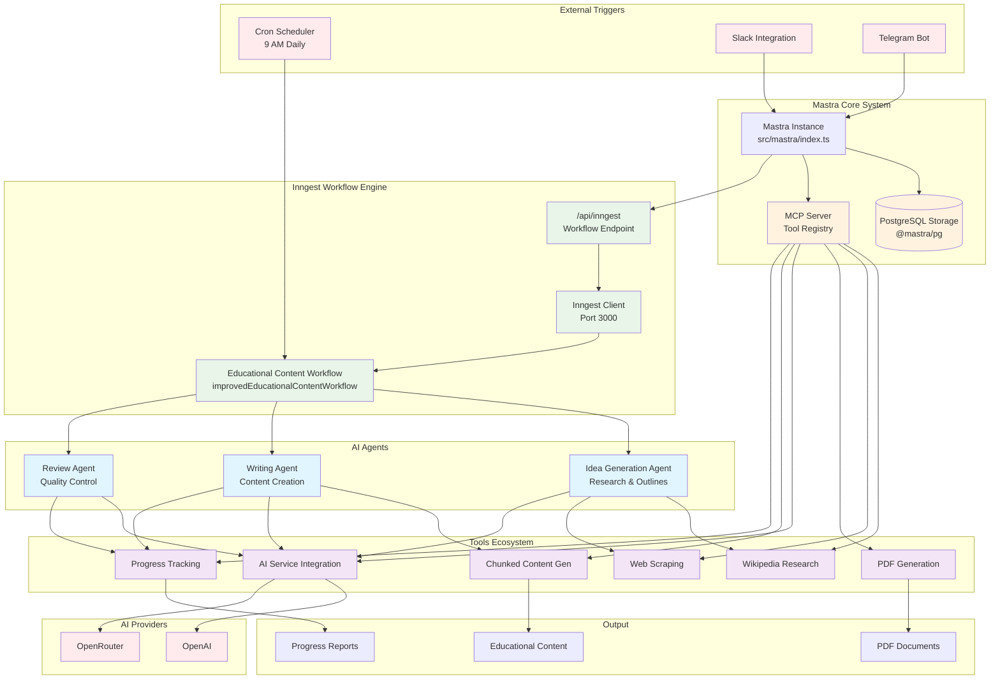
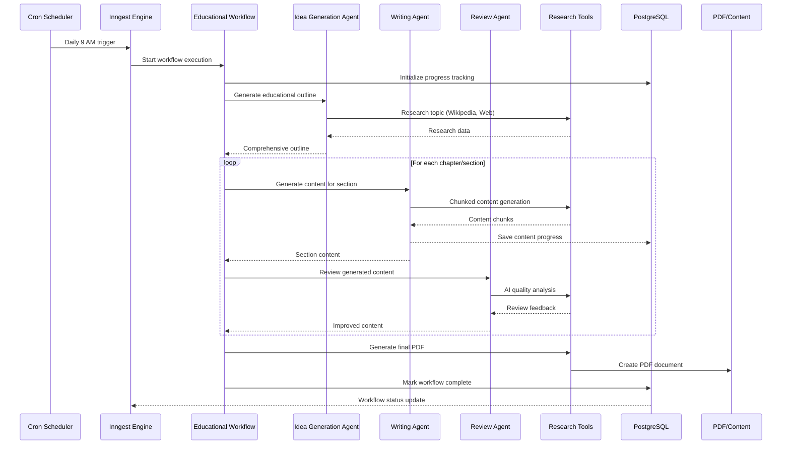
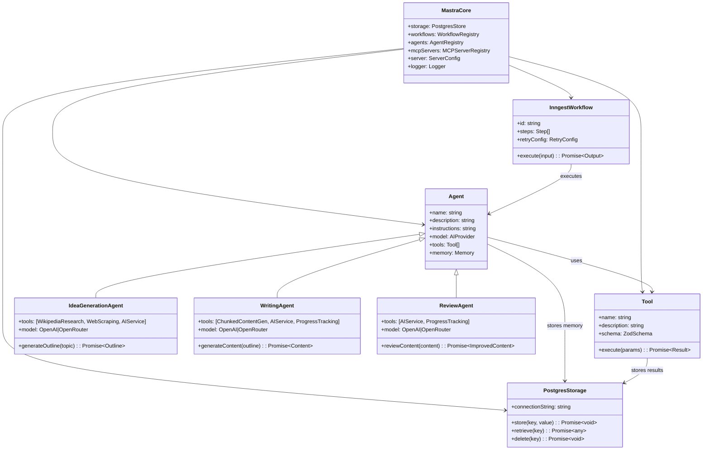
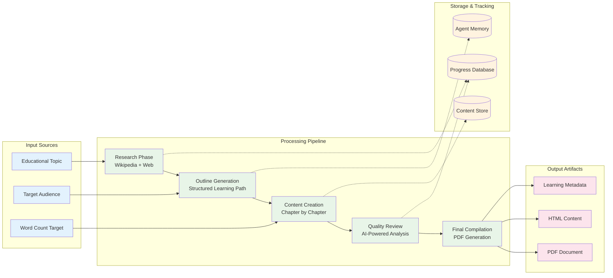
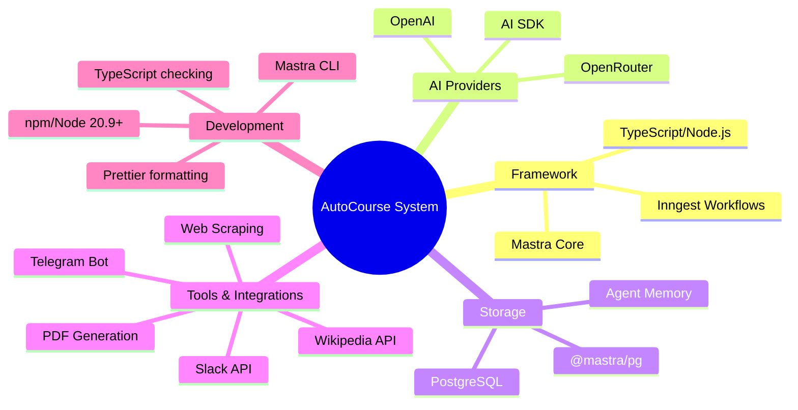

# AutoCourse System Architecture

## Overall System Architecture

```mermaid
graph TB
    subgraph "External Triggers"
        CRON[Cron Scheduler<br/>9 AM Daily]
        SLACK[Slack Integration]
        TELEGRAM[Telegram Bot]
    end

    subgraph "Mastra Core System"
        MASTRA[Mastra Instance<br/>src/mastra/index.ts]
        STORAGE[(PostgreSQL Storage<br/>@mastra/pg)]
        MCP[MCP Server<br/>Tool Registry]
    end

    subgraph "Inngest Workflow Engine"
        INNGEST[Inngest Client<br/>Port 3000]
        WF[Educational Content Workflow<br/>improvedEducationalContentWorkflow]
        API["/api/inngest"<br/>Workflow Endpoint]
    end

    subgraph "AI Agents"
        IDEA[Idea Generation Agent<br/>Research & Outlines]
        WRITE[Writing Agent<br/>Content Creation]
        REVIEW[Review Agent<br/>Quality Control]
    end

    subgraph "Tools Ecosystem"
        WIKI[Wikipedia Research]
        SCRAPE[Web Scraping]
        PDF[PDF Generation]
        AI[AI Service Integration]
        CHUNK[Chunked Content Gen]
        PROGRESS[Progress Tracking]
    end

    subgraph "AI Providers"
        OPENAI[OpenAI]
        OPENROUTER[OpenRouter]
    end

    subgraph "Output"
        CONTENT[Educational Content]
        PDFDOC[PDF Documents]
        REPORTS[Progress Reports]
    end

    %% Connections
    CRON --> WF
    SLACK --> MASTRA
    TELEGRAM --> MASTRA
    
    MASTRA --> STORAGE
    MASTRA --> MCP
    MASTRA --> API
    
    API --> INNGEST
    INNGEST --> WF
    
    WF --> IDEA
    WF --> WRITE
    WF --> REVIEW
    
    IDEA --> WIKI
    IDEA --> SCRAPE
    IDEA --> AI
    
    WRITE --> CHUNK
    WRITE --> AI
    WRITE --> PROGRESS
    
    REVIEW --> AI
    REVIEW --> PROGRESS
    
    PDF --> PDFDOC
    CHUNK --> CONTENT
    PROGRESS --> REPORTS
    
    AI --> OPENAI
    AI --> OPENROUTER
    
    MCP --> WIKI
    MCP --> SCRAPE
    MCP --> PDF
    MCP --> AI
    MCP --> CHUNK
    MCP --> PROGRESS

    classDef agent fill:#e1f5fe
    classDef tool fill:#f3e5f5
    classDef workflow fill:#e8f5e8
    classDef storage fill:#fff3e0
    classDef external fill:#ffebee

    class IDEA,WRITE,REVIEW agent
    class WIKI,SCRAPE,PDF,AI,CHUNK,PROGRESS tool
    class WF,INNGEST,API workflow
    class STORAGE,MCP storage
    class CRON,SLACK,TELEGRAM,OPENAI,OPENROUTER external
```

## Workflow Execution Flow

```mermaid
sequenceDiagram
    participant Cron as Cron Scheduler
    participant Inngest as Inngest Engine
    participant WF as Educational Workflow
    participant IdeaAgent as Idea Generation Agent
    participant WriteAgent as Writing Agent
    participant ReviewAgent as Review Agent
    participant Tools as Research Tools
    participant Storage as PostgreSQL
    participant Output as PDF/Content

    Cron->>Inngest: Daily 9 AM trigger
    Inngest->>WF: Start workflow execution
    
    WF->>Storage: Initialize progress tracking
    WF->>IdeaAgent: Generate educational outline
    
    IdeaAgent->>Tools: Research topic (Wikipedia, Web)
    Tools-->>IdeaAgent: Research data
    IdeaAgent-->>WF: Comprehensive outline
    
    loop For each chapter/section
        WF->>WriteAgent: Generate content for section
        WriteAgent->>Tools: Chunked content generation
        Tools-->>WriteAgent: Content chunks
        WriteAgent-->>Storage: Save content progress
        WriteAgent-->>WF: Section content
        
        WF->>ReviewAgent: Review generated content
        ReviewAgent->>Tools: AI quality analysis
        Tools-->>ReviewAgent: Review feedback
        ReviewAgent-->>WF: Improved content
    end
    
    WF->>Tools: Generate final PDF
    Tools->>Output: Create PDF document
    WF->>Storage: Mark workflow complete
    Storage-->>Inngest: Workflow status update
```

## Component Relationship Details

```mermaid
classDiagram
    class MastraCore {
        +storage: PostgresStore
        +workflows: WorkflowRegistry
        +agents: AgentRegistry
        +mcpServers: MCPServerRegistry
        +server: ServerConfig
        +logger: Logger
    }

    class InngestWorkflow {
        +id: string
        +steps: Step[]
        +retryConfig: RetryConfig
        +execute(input): Promise~Output~
    }

    class Agent {
        +name: string
        +description: string
        +instructions: string
        +model: AIProvider
        +tools: Tool[]
        +memory: Memory
    }

    class Tool {
        +name: string
        +description: string
        +schema: ZodSchema
        +execute(params): Promise~Result~
    }

    class PostgresStorage {
        +connectionString: string
        +store(key, value): Promise~void~
        +retrieve(key): Promise~any~
        +delete(key): Promise~void~
    }

    MastraCore --> InngestWorkflow
    MastraCore --> Agent
    MastraCore --> Tool
    MastraCore --> PostgresStorage
    
    InngestWorkflow --> Agent : executes
    Agent --> Tool : uses
    Agent --> PostgresStorage : stores memory
    Tool --> PostgresStorage : stores results

    class IdeaGenerationAgent {
        +tools: [WikipediaResearch, WebScraping, AIService]
        +model: OpenAI|OpenRouter
        +generateOutline(topic): Promise~Outline~
    }

    class WritingAgent {
        +tools: [ChunkedContentGen, AIService, ProgressTracking]
        +model: OpenAI|OpenRouter
        +generateContent(outline): Promise~Content~
    }

    class ReviewAgent {
        +tools: [AIService, ProgressTracking]
        +model: OpenAI|OpenRouter
        +reviewContent(content): Promise~ImprovedContent~
    }

    Agent <|-- IdeaGenerationAgent
    Agent <|-- WritingAgent
    Agent <|-- ReviewAgent
```

## Data Flow Architecture

```mermaid
flowchart LR
    subgraph "Input Sources"
        TOPIC[Educational Topic]
        AUDIENCE[Target Audience]
        WORDCOUNT[Word Count Target]
    end

    subgraph "Processing Pipeline"
        RESEARCH[Research Phase<br/>Wikipedia + Web]
        OUTLINE[Outline Generation<br/>Structured Learning Path]
        CONTENT[Content Creation<br/>Chapter by Chapter]
        REVIEW[Quality Review<br/>AI-Powered Analysis]
        COMPILE[Final Compilation<br/>PDF Generation]
    end

    subgraph "Storage & Tracking"
        PROGRESS[(Progress Database)]
        MEMORY[(Agent Memory)]
        CONTENT_STORE[(Content Store)]
    end

    subgraph "Output Artifacts"
        PDF_OUT[PDF Document]
        HTML_OUT[HTML Content]
        METADATA[Learning Metadata]
    end

    TOPIC --> RESEARCH
    AUDIENCE --> OUTLINE
    WORDCOUNT --> CONTENT
    
    RESEARCH --> OUTLINE
    OUTLINE --> CONTENT
    CONTENT --> REVIEW
    REVIEW --> COMPILE
    
    RESEARCH -.-> PROGRESS
    OUTLINE -.-> MEMORY
    CONTENT -.-> CONTENT_STORE
    REVIEW -.-> PROGRESS
    
    COMPILE --> PDF_OUT
    COMPILE --> HTML_OUT
    COMPILE --> METADATA

    classDef input fill:#e3f2fd
    classDef process fill:#e8f5e8
    classDef storage fill:#fff3e0
    classDef output fill:#fce4ec

    class TOPIC,AUDIENCE,WORDCOUNT input
    class RESEARCH,OUTLINE,CONTENT,REVIEW,COMPILE process
    class PROGRESS,MEMORY,CONTENT_STORE storage
    class PDF_OUT,HTML_OUT,METADATA output
```

## Technology Stack Overview

```mermaid
mindmap
  root((AutoCourse System))
    Framework
      Mastra Core
      Inngest Workflows
      TypeScript/Node.js
    AI Providers
      OpenAI
      OpenRouter
      AI SDK
    Storage
      PostgreSQL
      @mastra/pg
      Agent Memory
    Tools & Integrations
      Wikipedia API
      Web Scraping
      PDF Generation
      Slack API
      Telegram Bot
    Development
      npm/Node 20.9+
      Prettier formatting
      TypeScript checking
      Mastra CLI
```